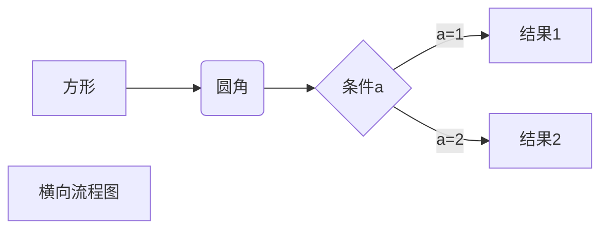

## 编译环境
 

### 1、c/c++程序的执行过程
    首先c执行的顺序是：1. 预处理；2. 编译（gcc/g++）；3. 汇编（as）4. 链接（ld）。参考链接：https://www.cnblogs.com/CarpenterLee/p/5994681.html

1. 预处理：

    是指将所有#include头文件以及宏定义替换成真正的内容，预处理之后得到的仍然是文本文件，但是文件体积会变大。并且预处理也是有相应的命令的。
    > gcc -E -I./ test.c -o test.i

    上述命令中-E是让编译器在预处理以后就退出，不进行后续编译过程；-I指定头文件目录，这里指定的是我们自定义的头文件目录；-o指定输出文件名。

2. 编译：

    这里的编译不是指程序从源文件到二进制程序的全部过程，而是只将经过预处理之后的程序转化成特定汇编代码（assembly code）的过程。

    > gcc -S -I./ test.c -o test.s 或 gcc -S test.i -o test.s

    上述命令中-S让编译器在编译之后停止，不进行后续过程。编译过程完成后，将生成程序的汇编代码，这也是文本文件。
3. 汇编：

    汇编过程将上一步的汇编代码转换成机器码（machine code），这一步产生的文件叫做目标文件，是二进制格式，gcc汇编过程通过as命令完成。
    > as test.s -o test.o 或 gcc -c test.s -o test.o

    这一步将会为每一个源文件产生一个目标文件，因此如果有多个c文件要依次进行编译。
4. 链接（Linking）:

    链接过程将多个目标文件以及所需要的库文件（.os等）链接成最终可执行文件（executable file），链接过程使用链接器将该目标文件与其他目标文件、库文件、启动文件等链接起来生成可执行文件。。但是如果我们通过这种方式在这一步上没有这么简单，主要是因为后面的这些依赖关系。但是流程是这样的。
    > ld -o test.out test.o inc/mymath.o ...libraries...
5. 总结：

    经过以上分析，我们发现编译过程并不像想象的那么简单，而是要经过预处理、编译、汇编、链接。尽管我们平时使用gcc命令的时候没有关心中间过程，到那时每次程序的编译都少不了这几个步骤。也不用为上述繁琐的过程而苦恼。

### 2、VScode编译多个c文件的问题
1. VSCode简介
    VSCode是一款微软出的轻量级编辑器，它本身只是一款文本编辑器而已，所有的功能都是以插件扩展的形式所存在，想用什么功能就安装对应的扩展插件即可，非常方便，同时也支持非常多的主题和图标，外观比较好看，重要的是VSCode支持各大主流操作系统。
2. VSCode运行C\C++程序的原理
   - 其实，如果要通俗的理解就是，VScode通过配置文件依次去执行相应的命令，从而达到运行C\C++的目的。
   - 因此很多的执行都可能需要我们自己手动去配置，例如当多个C文件相互连接的时候，我们就需要有同时执行多个C\C++文件的命令才能完成，这个时候就要去配置文件中看。主要是在settings.json文件中，将filename改成*.c就好了，也就是去执行这个目录下的其他可能相关的.c文件。
3. VSCode调试C程序问题
    - 主要是发生在配置文件中。

### 3、Makefile教程
    Makefile描述的是文件编译的相关规则,同时它也像shell脚本一样，可以执行操作系统的命令。
`参考链接` :  http://c.biancheng.net/view/7097.html

1. Makefile文件是什么？
    - 很多初学者不了解Makefile是什么？因为Windows下的集成开发环境（IDE）已经内置了Makefile，或者说回自动生成Makefile，我们不需要去手动编写。但是在Linux下做开发，不了解Makefile是一件非常失败的事情，甚至说是一个不合格的Linux开发工程师。不了解Makefile，就操作不了多文件编程，就完成不了相对于大的工程项目的操作。
    - Makefile可以简单的认为是一个工程文件的编译规则，描述了整个工程的编译链接等规则。其中包含了哪些文件需要编译，哪些文件不需要编译，哪些文件需要先编译，哪些文件需要后编译，哪些文件需要重建等等。编译整个工程需要涉及到的，在Makefile中都可以进行描述。换句话说，Makefile可以使得我们的项目工程的编译变得自动化，不需要每次都手动输入一堆源文件和参数。
    - 编译的时候需要链接的库的问题。gcc编译的时候只会默认链接一些基本的C语言标准库，很多源文件依赖的标准库都需要我们手动链接。例如math库、SQLite、线程等，还可能去链接很多第三方库。所以在编译的时候命令会很长，并且在编译的时候我们可能会涉及到文件链接的顺序问题，所以手动编译会很麻烦。因此可以在Makefile文件中，制定相应的规则和对应的链接顺序。
    - 如果编译的工程很大，将会花费很长的时间。但是Makefile可以解决这样一个问题，Makefile支持多线程并发操作，会极大的缩短我们的编译时间，并且当我们修改了源文件之后，编译整个工程的时候，make只会编译我们修改过的文件，没有修改的文件不用重新编译，也极大的解决了我们耗费时间的问题。
    - 编译的时候也会有其他常见的问题，比如：工程文件的源文件类型很多，编译的话需要选择编译器；文件可能会分布在不同的目录汇总，使用时需要调价路径，这些问题都可以通过Makefile解决。并且Makefile只需要完成一次，一般我们只要不增加或者删除工程的文件，Makefile基本不用去修改。

2. Makefile文件中包含哪些规则？
    - Makefile的规则分为两部分，分别是依赖关系和执行命令。
    > targets:prerequisites

    > command
    - Makefile中的内容，它主要包含五个部分，分别是
        - `显示规则`：说明如何生成一个或多个的目标文件。这是有Makefile的书写着明显指出。要生成的文件，文件的依赖，生成的命令
        - `隐晦规则`：由make命令有自动推导的功能，所以隐晦的规则可以让我们比较粗糙地简略书写Makefile，这是make命令所支持的。
        - `变量的定义`：在Makefile中我们要定义一系列的变量，变量一般都是字符串，当Makefile被执行时，其中的变量都会被扩展到相应的引用位置上。
        - `文件指示`：其中包括了三个部分，一个是在一个Makefile中引用了另一个Makefile；另一个是根据某些情况指定Makefile中的有效部分；还有一个就是多行命令。
        - 注释：#
3. Makefile的工作流程
    - 在shell命令执行的make命令。是从上往下的。make不会先执行命令，而是首先处理目标所依赖的文件的更新规则。1）如果不存在，使用其描述规则创建它；2）如果存在，则看它所依赖的文件和该文件是否被修改过。3）如果文件存在，并且也没有修改，则什么都不做。

4. Makefile变量的定义和使用
    - `参考网址`：http://c.biancheng.net/view/7096.html
    - 主要是介绍几种赋值的操作。
5. Makefile自动化变量
    - 在模式规则中，规则的目标和依赖的文件名代表了一类的文件。规则的命令是对所有这一类文件的描述。我们在makefile中描述规则时，依赖文件和目标文件是变动的，显然在命令中出现具体的文件名称，否则模式负责将失去意义。

### 4、GDB调试工具

1. 不管是调试什么程序，在编译的时候一定要加上-g的参数，表示生成调试信息。`并且调试的-g参数是在编译汇编的过程中设定的，而不是在链接的过程中设定的`。
2. `GDB调试多个.c文件的时候`，例如从main函数到hello函数，则需要我们先在main函数中找到调用hello函数的行号，从而在该位置设置断点，然后使用s命令进入该函数中调试，如果使用n则只会在main函数中执行下一个语句。
    - `备注`: 多个文件调试的时候，`需要将所有文件都设置为可调式的`，否则，调试就只能在可调式的文件中进行。并且一定要找到对应的调用函数的位置，才能够进行调试，都则就没有用。
3. gdb命令：
    > set args 5005：设定参数

    > list：查看当前可调试的代码；

    > list 12：查看当前可调试代码12行的上下区间。

    > list 12 14：显示12到14行的代码。

    > b 12 或者break 12: 设置调试断点。

    > run：开始运行调试程序。

    > next或n：执行下一步

    > next 5：执行5次下一步。

    > step或s：这样也会执行一行代码，不过如果遇到可调试的函数，会进入函数内部，再一行一行的执行。

    > finish：运行程序，直到当前函数运行完毕返回在停止。

    > info breakpoints：显示所有的断点、断点号、断点位置等。

    > delete 1：删除1号断点。

    > delete：删除所有断点。

    > continue：如果没有断点就一直运行下去。

    > print var：显示变量的值。print是一个很强的命令，利用它可以显示被调试的语言中任何有效的表达式。

    > print *a@10：输出数组的10个元素

    > whatis var：显示一个变量的类型。

    > ptype var：会打印出var的结构体定义。

### 5、vim命令
-      set nu ：临时显示行号；
-       12，15 move 8 ： 移动第12到15行的数据到第8行后面；
-       I： 在行首插入
-       i： 当前位置前插入
-       A： 行末插入
-      a:  当前位置后插入
-       dd: 删除当前行
-       u： 撤销
-       3,5d: 删除指定范围的行

